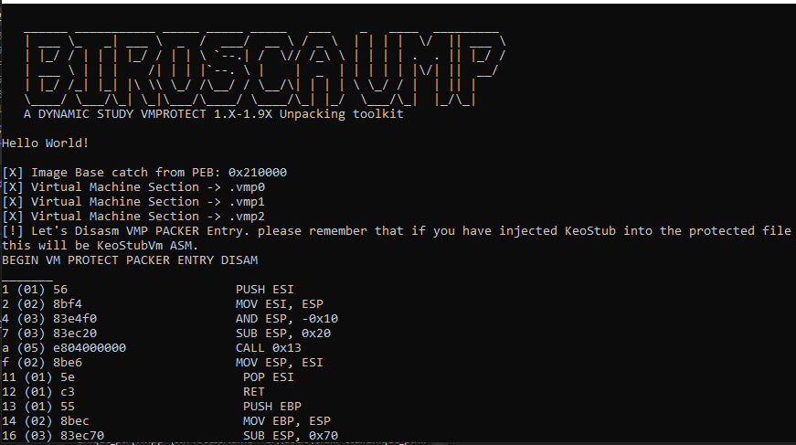
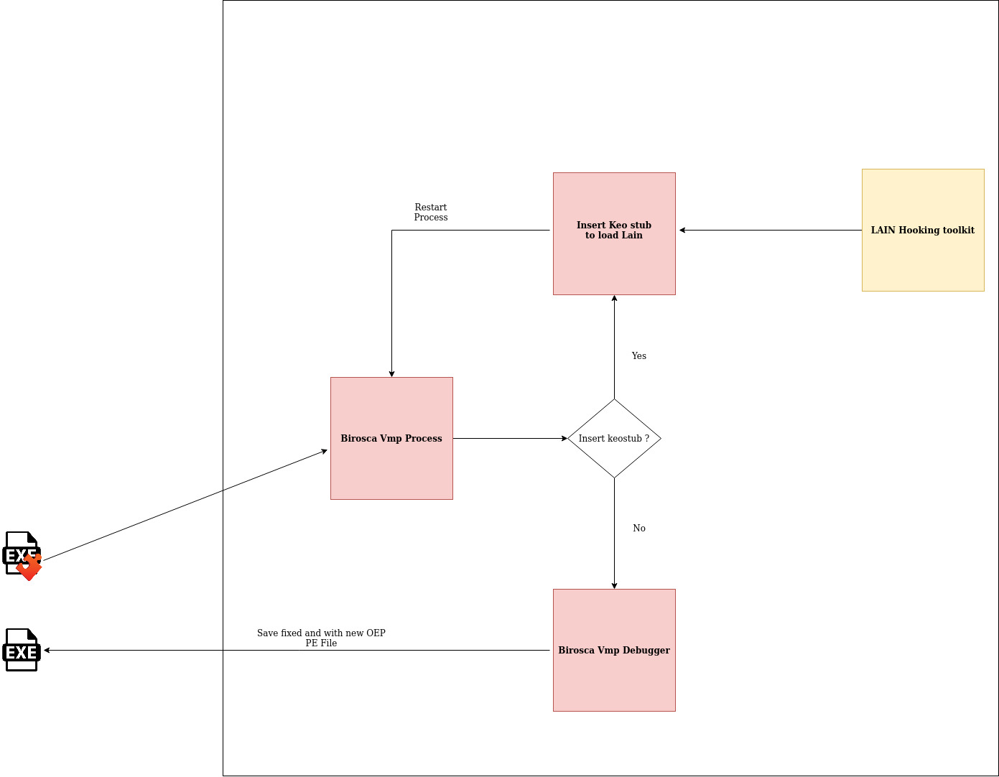
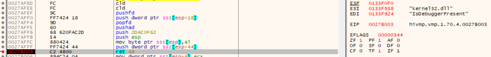
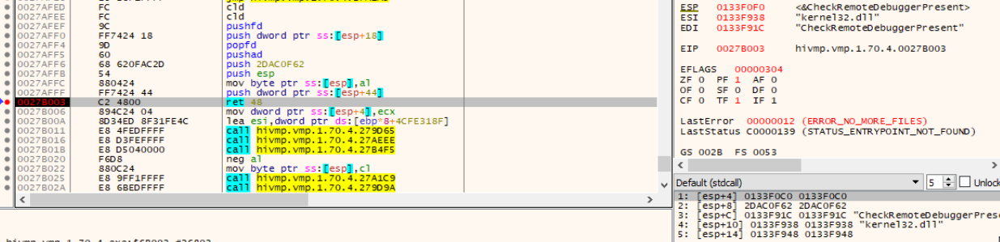
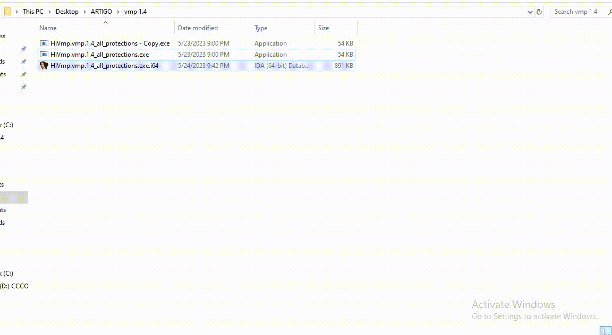

# Birosca VMP

A Dynamic Study Vmprotect 1.x-1.9X Unpacking Toolkit, Recovery OEP, FIX PE, IAT and bypass protection with custom Loader and interceptor vmexit(aka context exchange) from packer stub.



### How it work

Diagram of the operation of the Birosca framework:




##### Birosca:
- Debugger vmprotect process
- Find OEP (Based on vm type)
- Insert Keo Stub to load Lain
- Find Vmexit(aka context exchange) standard present on version bellow than 2.x
- Make raw dumps
- Fix PE and IAT and make a dump

##### Lain:
- Hooking Anti-debugger (Usermode, Kernel Mode, Antivm)
- Give process memory level access to Birosca without VmProtect detecting it.

Birosca (A Brazilian term that accurately describes the functioning of the project: A simple project that fulfills its purpose without offering anything more for it, nor presenting itself as an expert, and focuses on its own growth over time. The tool was not developed for anything other than studies.) Birosca is capable of obtaining the Entrypoint of all versions below 2.X of the commercial packer VMPROTECT, through routines nicknamed "vmexit(aka context exchange)". During the development of the tool, the packer was studied in different protected files and versions to find the pattern present in these routines of virtualized code exit. Signatures were created for both (which work in a generic way), and the "vmexit(aka context exchange)" routines are used for context switching, API loading, and jumps to addresses when they have already been processed by the virtualized code of vmprotect (which is unique). However, the "vmexit"(aka context exchange) routines are standardized. Here is an example of such a routine:

```
.vmp2:0006AFED			 _vmexit_        proc near
.vmp2:0006AFED                   var_2C          = byte ptr -2Ch
.vmp2:0006AFED                   arg_10          = dword ptr  14h
.vmp2:0006AFED                   arg_14          = dword ptr  18h
.vmp2:0006AFED
.vmp2:0006AFED FC                                  cld
.vmp2:0006AFEE FC                                  cld
.vmp2:0006AFEF 9C                                  pushf
.vmp2:0006AFF0 FF 74 24 18                         push    [esp+4+arg_10]
.vmp2:0006AFF4 9D                                  popf
.vmp2:0006AFF5 60                                  pusha
.vmp2:0006AFF6 68 62 0F AC 2D                      push    2DAC0F62h
.vmp2:0006AFFB 54                                  push    esp
.vmp2:0006AFFC 88 04 24                            mov     [esp+2Ch+var_2C], al
.vmp2:0006AFFF FF 74 24 44                         push    [esp+2Ch+arg_14]
.vmp2:0006B003 C2 48 00                            retn    48h ; 'H'       ; Vai saltar ao endereço de stack(Alguns hooks também fazem isso. com informações via stack)
.vmp2:0006B003                               _vmexit_        endp
```
Example of vmexit routine in action (For Usermode Anti-debug checks):






In the examples of the screenshots above, vmprotect uses the routine to check for user-mode debuggers. However, it is also capable of checking for kernel-mode debuggers. It also utilizes syscalls for these checks, and after that, it will initiate the process of initializing the original PE.

In total, versions below 2.x perform the following calls for verification:

| Module   | API                        |
|----------|----------------------------|
| kernel32 | IsDebuggerPresent          |
| kernel32 | CheckRemoteDebuggerPresent |
| Kernel32 | GetThreadContext           |
| ntdll    | ZwQueryInformationProcess  |
| ntdll    | ZwSetInformationThread     |
| kernel32 | CreateFileA                |

[ ! ] CreateFileA is used to check for debuggers using:
- \\\\.\\SICE
- \\\\.\\SIWVID
- \\\\.\\NTICE
- \\\\.\\ICEEXT
- \\\\.\\SYSERBOOT

All these calls can be bypassed simply by inserting the Keo stub so that Birosca can load the "KELAIN" module into memory space and handle the calls to these APIs. This allows the Birosca VMP debugger to function smoothly.

### Running Birosca



Birosca output log:

```

   ______ ___________ _____ _____ _____   ___    _   ____  _________ 
   | ___ \_   _| ___ \  _  /  ___/  __ \ / _ \  | | | |  \/  || ___ \
   | |_/ / | | | |_/ / | | \ `--.| /  \// /_\ \ | | | | .  . || |_/ /
   | ___ \ | | |    /| | | |`--. \ |    |  _  | | | | | |\/| ||  __/ 
   | |_/ /_| |_| |\ \\ \_/ /\__/ / \__/\| | | | \ \_/ / |  | || |    
   \____/ \___/\_| \_|\___/\____/ \____/\_| |_/  \___/\_|  |_/\_|     
   A DYNAMIC STUDY VMPROTECT 1.X-1.9X Unpacking toolkit                                                   
    
Hello World!

[X] Image Base catch from PEB: 0x400000
[X] Virtual Machine Section -> .vmp0
[X] Virtual Machine Section -> .vmp1
[!] Let's Disasm VMP PACKER Entry. please remember that if you have injected KeoStub into the protected file
this will be KeoStubVm ASM.
BEGIN VM PROTECT PACKER ENTRY DISAM
_______
1 (05) e953130100               JMP 0x11359
6 (05) e9f24c0000               JMP 0x4cfd
b (05) e95e260000               JMP 0x266e
10 (05) e9792a0000               JMP 0x2a8e
15 (05) e9a4350000               JMP 0x35be
1a (05) e9ef340000               JMP 0x350e
1f (05) e9fd4c0000               JMP 0x4d21
24 (05) e9d5130000               JMP 0x13fe
29 (05) e950130000               JMP 0x137e
2e (05) e98b270000               JMP 0x27be
33 (05) e9d6150000               JMP 0x160e
38 (05) e971350000               JMP 0x35ae
3d (01) e9                       DB 0xe9
3e (01) 9c                       PUSHF
3f (02) 3c00                     CMP AL, 0x0
_______
END VM PROTECT PACKER ENTRY DISAM
[?] Searching on .vmp0
________REG'S________
RAX: 7fffa23711dd
RBX: b36000
RCX: 7fffa233c574
RDX: 0
RSI: 7fffa23cd4c0
RDI: 10
RIP: 7fffa23711dd
RSP: 8fedb0
RBP: 0
EFLAGS: 246
_____________________
________REG'S________
RAX: 7fffa23711dd
RBX: b36000
RCX: 7fffa233c574
RDX: 0
RSI: 7fffa23cd4c0
RDI: 10
RIP: 7fffa23711dd
RSP: 8fedb0
RBP: 0
EFLAGS: 246
_____________________
________REG'S________
RAX: 77c3e9d3
RBX: b37000
RCX: 595a39d07ac20000
RDX: 0
RSI: d81e28
RDI: 77b9688c
RIP: 77c3e9d3
RSP: 9ff370
RBP: 9ff39c
EFLAGS: 246
_____________________
________REG'S________
RAX: 422276
RBX: b37000
RCX: 411023
RDX: 411023
RSI: 411023
RDI: 411023
RIP: 422276
RSP: 9ff8bc
RBP: 9ff8d0
EFLAGS: 246
_____________________
Entrypoint recovery from vmexit into third position of stack: 0x412df0
BEGIN ENTRY POINT ROUTINE ASM RECOVERED FROM VMEXIT
_______
1 (01) 55                       PUSH EBP
2 (02) 8bec                     MOV EBP, ESP
4 (05) e858fcffff               CALL 0xfffffc61
9 (01) 5d                       POP EBP
a (01) c3                       RET
b (01) cc                       INT 3
c (01) cc                       INT 3
d (01) cc                       INT 3
e (01) cc                       INT 3
f (01) cc                       INT 3
10 (01) cc                       INT 3
11 (01) 55                       PUSH EBP
12 (02) 8bec                     MOV EBP, ESP
14 (01) 83                       DB 0x83
_______
END ENTRY POINT ROUTINE ASM RECOVERED FROM VMEXIT
if you are trying to unpack a VB 6.0 binary protected with VM Protect. remember that the entrypoint is not the entrypoint routine, but the entrypoint of the VB 6.0 opcode that Vmprotect has already resolved the symbol of the DLL(MSVBVM60.DLL) that interprets the opcodes and only makes the call, the stubs are the same, you can solve it manually only with the address I gave you.
```

Feel free to collaborate on improvements. this is developed for my study (This technique obviously won't work for newer versions as vmexit presents itself differently).